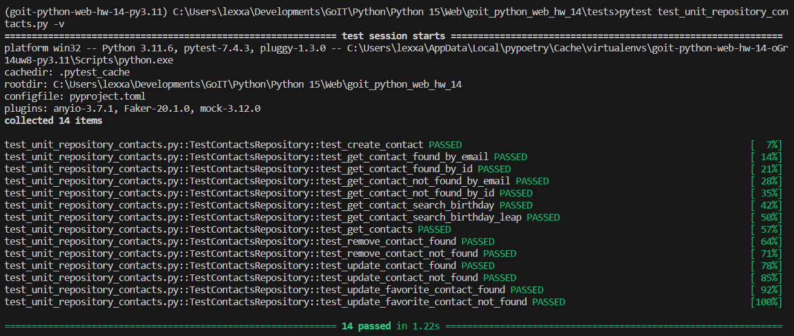
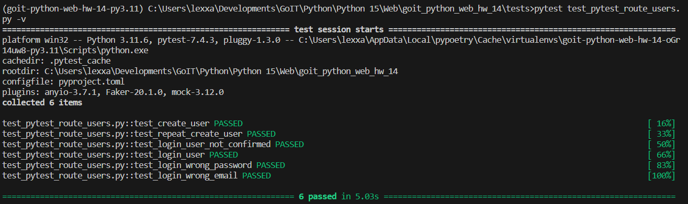

# goit_python_web_hw_14
GoIT, Python WEB, Homework number 14. Documentation. Testing.


# Домашнє завдання #14

У цьому домашньому завданні ми продовжуємо доопрацьовувати наш `REST API` застосунок із [домашнього завдання 13](https://github.com/lexxai/goit_python_web_hw_13).

## Завдання

1. За допомогою `Sphinx` створіть документацію для вашого домашнього завдання. Для цього додайте в основних модулях до необхідних функцій і методів класів рядки `docstrings`.
2. Покрийте модульними тестами модулі репозиторію домашнього завдання, використовуючи фреймворк `Unittest`. За основу візьміть приклад із конспекту для модуля `tests/test_unit_repository_notes.py`
3. Покрийте функціональними тестами будь-який маршрут на вибір з вашого домашнього завдання, використовуючи фреймворк pytest.

## Додаткове завдання

4. Покрийте ваше домашнє завдання тестами більш ніж на 95%. Для контролю використовуйте пакет `pytest-cov`


#  Виконання

## 1. Sphinx документація
### Встановити `sphinx`: 
```
poetry add sphinx --group dev
``` 
або 
```
poetry update
```

### sphinx-build


### sphinx html


### sphinx static html link 'Sphinx Doc' on main page


## 2. Unittest
### 2.1 Repository contacts


## 3. Pytest
### 3.1 Repository contacts

### 3.2 Route auth, users

### 3.2 Route contacts


## 4. Pytest-cov  Cover
### Install:

```
poetry add pytest-cov -G test
```
### Run terminal report:

```
pytest --cov=. --cov-report term  tests/
```


### Run HTML report to folder htmlcov
```
>pytest --cov=. --cov-report html  tests/  
========================================================================== test session starts ===========================================================================
platform win32 -- Python 3.11.6, pytest-7.4.3, pluggy-1.3.0
rootdir: C:\Users\lexxa\Developments\GoIT\Python\Python 15\Web\goit_python_web_hw_14
configfile: pyproject.toml
plugins: anyio-3.7.1, Faker-20.1.0, cov-4.1.0, mock-3.12.0
collected 28 items

tests\test_pytest_route_contacts.py ........                                                                                                                        [ 28%]
tests\test_pytest_route_users.py ......                                                                                                                             [ 50%]
tests\test_unit_repository_contacts.py ..............                                                                                                               [100%]

---------- coverage: platform win32, python 3.11.6-final-0 -----------
Coverage HTML written to dir htmlcov
```


## 5. Docker


Docker Hub url: https://hub.docker.com/r/lexxai/web_hw14


