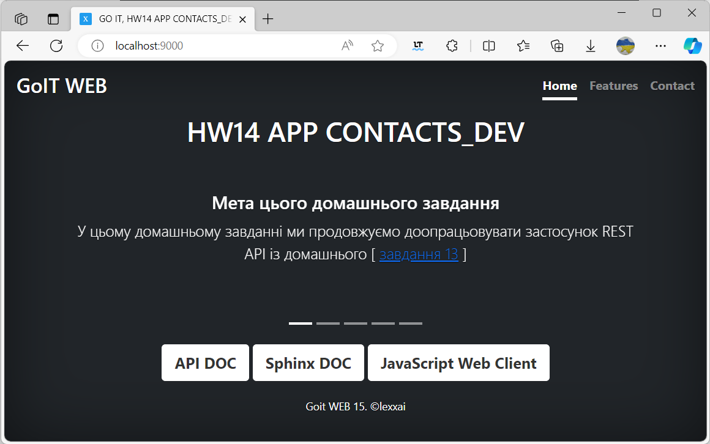

# goit_python_web_hw_14
GoIT, Python WEB, Homework number 14. Documentation. Testing.


# Домашнє завдання #14

У цьому домашньому завданні ми продовжуємо доопрацьовувати наш `REST API` застосунок із [домашнього завдання 13](https://github.com/lexxai/goit_python_web_hw_13).

## Завдання

1. За допомогою `Sphinx` створіть документацію для вашого домашнього завдання. Для цього додайте в основних модулях до необхідних функцій і методів класів рядки `docstrings`.
2. Покрийте модульними тестами модулі репозиторію домашнього завдання, використовуючи фреймворк `Unittest`. За основу візьміть приклад із конспекту для модуля `tests/test_unit_repository_notes.py`
3. Покрийте функціональними тестами будь-який маршрут на вибір з вашого домашнього завдання, використовуючи фреймворк pytest.

## Додаткове завдання

4. Покрийте ваше домашнє завдання тестами більш ніж на 95%. Для контролю використовуйте пакет `pytest-cov`


#  Виконання

## 1. Sphinx документація
### Встановити `sphinx`: 
```
poetry add sphinx --group dev
``` 
або 
```
poetry update
```

### sphinx-build


### sphinx html


### sphinx static html link 'Sphinx Doc' on main page



